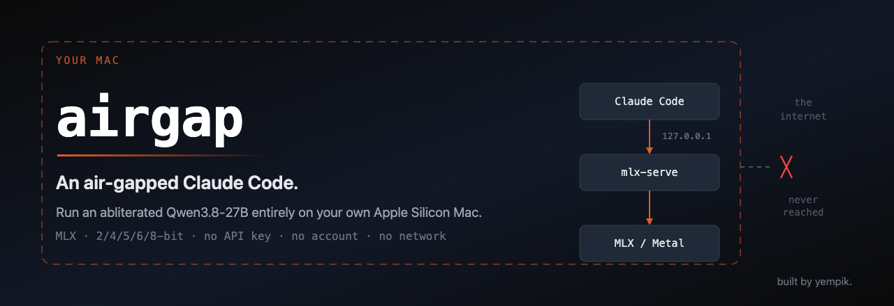

<div align="center">



# `airgap`

### An air-gapped Claude Code.

Run an abliterated **Qwen3.8-27B** entirely on your own Apple Silicon Mac, and point Claude Code at it. No API key, no account, no network. **The scripts enforce the air gap rather than recommending it** — the server refuses to start if it is pointed anywhere but your own machine.

<sub><code>Qwen3.8-27B</code> · MLX 2/4/5/6/8-bit · uncensored · abliterated · refusal-removed · Apple Silicon M1–M4 · 100% offline · local Claude Code backend</sub>

<br>


<sub><b>In produzione, non in slide.</b> · by <a href="https://yempik.com"><b>yempik.</b></a> · maintained by <a href="https://www.linkedin.com/in/simone-bova/"><b>Simone Bova</b></a></sub>

</div>

---

## Why this exists

Some work cannot go to a hosted API. Not because of what it says — because of what it *is*: client code under NDA, an unreleased product, a security review. Anything where *"we sent it to a third party"* is the wrong sentence in a post-mortem.

The usual answer is a local model, and the usual result is a weekend lost to it. The weights arrive as 135-byte placeholder files. The runtime silently discards the checkpoint's best feature. The server binds to `0.0.0.0` and quietly offers an uncensored model to the coffee shop wifi. The Mac swaps itself into a coma at 19 GB.

`airgap` is that weekend, already spent — what yempik uses when we want a capable model on sensitive projects, packaged so the failure modes are guard rails instead of surprises.

---

## Will it run on your Mac

`./bin/doctor.sh` prints your row and refuses to go further if the answer is no.

| Memory | Verdict | Build | Context | Free RAM needed |
|:--|:--|:--|--:|--:|
| 8 / 16 / 18 GB | ✕ Does not fit | run Qwen3-4B / 8B / 14B instead | — | — |
| 24 GB | ⚠ Not recommended | 4-bit · 16.3 GB | 16,384 | 18 GB |
| 32 GB | ⚠ Tight | 4-bit · 16.3 GB | 32,768 | 19 GB |
| **36 GB** | **✓ Workable — the tested machine** | **5-bit · 19.1 GB** | **65,536** | **22 GB** |
| 48 GB | ✓ Comfortable | 5-bit · 19.1 GB | 131,072 | 26 GB |
| 64 GB | ✓ Comfortable | 8-bit · 27.7 GB | 131,072 | 36 GB |
| 96 GB+ | ✓ Comfortable | 8-bit · 27.7 GB | 262,144 | 40 GB |

Apple Silicon only — Intel Macs, Windows and Linux cannot run this. Budget **45 GB of disk** while downloading, 20 GB after.

---

## Install

```bash
git clone https://github.com/yempik-ai/airgap.git airgap && cd airgap
```

```bash
./start.sh
```

**`./start.sh` is the only command you need to remember.** It installs the tools, downloads the model (asking first — it is 20 GB), proves the weights are real files, runs 21 health checks, and stops with a plain-English fix the moment anything needs you. Safe to run again at any time: finished steps are skipped.

**Then two commands, in two Terminal windows:**

```bash
./bin/serve.sh          # window 1 — the server. Leave it open.
./bin/claude-local.sh   # window 2 — Claude Code, pointed at your Mac.
```

`./bin/stop.sh` stops the server and hands the memory straight back.

Free memory before starting the server — it refuses to start below the threshold and names the apps to close. Never used Terminal? [`docs/02-install.md`](docs/02-install.md) assumes nothing at all.

<details>
<summary><b>Prefer to run the steps yourself?</b></summary>

`start.sh` runs exactly these, in this order, and each one prints the next.

| # | Command | What it does |
|:--|:--|:--|
| 1 | `./bin/setup.sh` | installs git-lfs + mlx-serve; checks Homebrew and Claude Code |
| 2 | `./bin/download-model.sh` | the 20 GB — resumable, pointer-verified, de-duplicated |
| 3 | `./bin/verify-model.sh` | proves the weights are real, not 135-byte placeholders |
| 4 | `./bin/doctor.sh` | 21 checks, PASS/FAIL with a fix each. Changes nothing |
| 5 | `./bin/serve.sh` | starts the server. Leave the window open |
| 6 | `./bin/claude-local.sh` | Claude Code, second window, pointed at you |

</details>

### Too big? Pick a smaller build

The 27B at 5-bit is the *tested* build, not the only one. You do not have to go hunting on Hugging Face — `./bin/models.sh list` shows every known Qwen3.8 MLX build with its real download size and whether it fits **your** Mac.

| key | download | needs free | |
|:--|--:|--:|:--|
| `9b-4bit` | 4.7 GB | 8 GB | smallest — but **stock**, safety training intact |
| `27b-2bit` | 7.8 GB | 11 GB | smallest abliterated. 2-bit costs real quality |
| `27b-4bit-aeon` | 14.1 GB | 18 GB | a different abliteration lineage (AEON) |
| `27b-4bit` | 16.9 GB | 21 GB | the sensible choice on a 32 GB Mac |
| **`27b-5bit`** | **20.0 GB** | **23 GB** | **the tested build — every measured number here came from it** |
| `27b-6bit` | 23.0 GB | 26 GB | only with memory to spare |
| `27b-8bit` | 29.1 GB | 32 GB | wants a 48 GB Mac |

Sizes are the real `.safetensors` totals read from Hugging Face, not estimates. Switching takes three commands and keeps both models on disk:

```bash
./bin/stop.sh
./bin/models.sh pull 27b-4bit && ./bin/models.sh use 27b-4bit
./bin/serve.sh
```

Any other MLX model works too — `./bin/download-model.sh <org>/<repo>`, then `./bin/models.sh use <org>/<repo>`.

---

## Pick your path

```text
"Will this even run on my Mac?"                    ← start here
   → docs/01-requirements.md          ⏱ 2 min, before you download 20 GB

"I have never used Terminal. Walk me through it."
   → docs/02-install.md               ⏱ 30 min + download time

"It is downloaded. How do I actually use it?"
   → docs/05-run-it.md                ⏱ 10 min

"Something broke."
   → docs/06-troubleshooting.md       symptom-first lookup table

"Why is any of this the way it is?"                ← the interesting one
   → docs/08-how-it-works.md          ⏱ 45 min, from first principles

"I want it faster, or longer, or lighter."
   → docs/07-tuning.md
```

---

## How it works

```text
  you ─▶ Claude Code ─▶ 127.0.0.1:11234 ─▶ mlx-serve ─▶ MLX / Metal ─▶ Apple Silicon
                             │
                   physically cannot leave this Mac
```

**There is nothing in the middle.** Claude Code speaks the Anthropic Messages API and `mlx-serve` speaks it natively. Most local setups need a translation proxy between the two — one more process to install, one more to break, and a lossy round-trip through a foreign tool-calling schema.

Three things make this model unusually good on a laptop:

- **48 of its 64 layers are not attention layers.** They are Gated DeltaNet layers with a *fixed-size* memory, so only 16 layers hold a cache that grows with your conversation — a 4× smaller KV cache than a normal 27B, and the reason a 262,144-token context is arithmetically possible at all.
- **It ships its own drafter.** A multi-token-prediction head inside the checkpoint guesses its own next tokens; the model then verifies a whole batch in one pass. The output is *mathematically identical*, not approximated — the publisher measured 10.15 s → 6.81 s with a matching SHA-256.
- **Stock `mlx-lm` deletes that head on load.** One line: `if "mtp." not in k`. That is why this stack runs `mlx-serve`, which implements native Qwen MTP. The publisher measured the difference at roughly 1.5× — [not yet reproduced here](#what-has-and-has-not-been-run-here).

### Measured on the test machine

| | |
|:--|--:|
| Claude Code system prompt, MCP servers loaded | 38,054 tokens |
| …with `--strict-mcp-config`, the default here | **20,909 tokens** |
| Prefix cache reuse on turn 2 | 16,384 / 20,906 |
| Weights on disk, 5-bit, text-only (vision skipped) | 19.1 GB |
| Tokens per second | **not measured** |

No speed figure has been benchmarked, on this machine or any other. `./bin/bench.sh` produces a real one. Anything unmeasured is labelled unmeasured, here and throughout the docs.

### What has and has not been run here

Being precise about this matters more than looking finished.

| | |
|:--|:--|
| Checkpoint integrity, architecture, MTP head present in the bytes | ✓ verified — `bin/verify-model.sh` |
| Claude Code driving a local `mlx-serve` model, end to end | ✓ verified — but with **Qwen3.5-0.8B**, same `qwen3_5` architecture family |
| Anthropic `/v1/messages`, tool calling, prefix-cache reuse | ✓ verified on that smaller model |
| Every script's syntax, guards and refusals | ✓ verified |
| **The 27B itself, loaded and served** | **✕ not yet** — it needs 23 GB free; the test machine had 10.5 GB |
| **`mtp_loaded: true` on this checkpoint** | **✕ not yet confirmed** — see below |
| Tokens per second, prefill rate | ✕ never measured |

**The MTP caveat, stated plainly.** `mlx-serve` documents its native Qwen MTP head as auto-loading *"when the model dir ships `mtp/weights.safetensors`"*. **This checkpoint ships no such file** — its 29 MTP tensors are embedded in the main shards as `language_model.mtp.*`. The publisher reports MTP working on this exact checkpoint under mlx-serve 26.8.7, which is good evidence, but it is their measurement and has not been reproduced here.

`./bin/doctor.sh`, run while the server is up, reports `mtp_loaded` as PASS, WARN or SKIP. That is the check that settles it on your machine — and if it comes back WARN, the ~1.5× is not being delivered and the case for `mlx-serve` over `mlx-lm` is weaker than this page implies.

---

## The stack

| Component | Version | Role |
|:--|:--|:--|
| [`mlx-serve`](https://github.com/ddalcu/mlx-serve) | 26.8.8 | inference server — Anthropic, OpenAI and Ollama APIs on one port |
| MLX / Metal | 0.32.0 | Apple's array framework, running on the GPU |
| Qwen3.8-27B-Uncensored | 5-bit MLX | the weights — **not** in this repo |
| Claude Code | 2.1.233 | the harness you type into |

---

## Repo layout

```text
airgap/
├── start.sh                 ← the one command: tools, model, checks
├── bin/
│   ├── detect-hardware.sh   ← reads your Mac, derives every setting
│   ├── doctor.sh            ← 21 checks, a fix per failure
│   ├── setup.sh             ← installs the tooling
│   ├── models.sh            ← list / pull / use — choose which model to serve
│   ├── download-model.sh    ← the weights, done correctly
│   ├── serve.sh             ← the only script that loads the model
│   ├── claude-local.sh      ← Claude Code, pinned to loopback
│   ├── stop.sh              ← hands the memory straight back
│   ├── verify-model.sh      ← integrity check
│   └── bench.sh             ← speculative decoding, on versus off
├── docs/                    ← 01 → 09, in reading order
└── config.env.example       ← every setting, with its default
```

---

## Honest limits

- **This is not Sonnet or Opus.** A 27B at 5-bit is materially weaker at long tool-calling chains and multi-step planning. Short, well-scoped tasks are where it earns its place.
- **36 GB is the edge, not the target.** The tested machine could not load the model until Docker and the browser were closed. 48 GB is where this stops being a negotiation.
- **The first response is slow.** ~21,000 tokens of system prompt must be processed before turn one. The prefix cache absorbs it from turn two onward.
- **Quantization compounds.** 5-bit weights *and* a 4-bit KV cache both cost quality. If long conversations degrade, relax the KV cache first — it is the cheaper one to give back.

---

## A note on the model

The checkpoint is **abliterated**: its publisher removed the refusal behaviour by orthogonalizing the refusal direction out of the residual stream. It has essentially no built-in guardrails and will comply with requests the base Qwen3.8 would decline.

That is workable for research on a machine you control, which is what this is. It is not something to put behind a shared endpoint. `serve.sh` therefore **refuses** — not warns — on a non-loopback host, on `--lan-share`, and on `--lan-discover`. The weights are Apache-2.0, derived from `Qwen/Qwen3.8-27B`; this repository ships none of them.

---

## FAQ

### Can I run a smaller version of Qwen3.8?

Yes. `./bin/models.sh list` shows seven MLX builds from 4.7 GB to 29.1 GB and marks which fit your Mac. The smallest **abliterated** option is a 2-bit 27B at 7.8 GB; the smallest overall is a stock 9B at 4.7 GB. `./bin/models.sh pull <key>` downloads one and `use <key>` switches to it — no hunting on Hugging Face, and both models stay on disk so switching back is instant.

### Can I run Qwen3.8 on a Mac?

Yes. Qwen3.8-27B runs on Apple Silicon Macs through **MLX**, Apple's array framework, using the `mlx-serve` inference server. You need an M-series chip and enough unified memory — 36 GB for the 5-bit build, 32 GB for 4-bit. Intel Macs cannot run it.

### How much RAM do I need to run Qwen3.8-27B locally?

The weights are **16.3 GB at 4-bit, 19.1 GB at 5-bit, 27.7 GB at 8-bit**, and all of it must fit in memory alongside macOS. In practice: 32 GB is tight, 36 GB works, 48 GB is comfortable. Under 24 GB, run a smaller model instead — Qwen3-14B, 8B or 4B. See [the table above](#will-it-run-on-your-mac).

### Is there an uncensored version of Qwen3.8?

Yes. This repository is built around **`chimingw/Qwen3.8-27B-Uncensored-OrcaRouter-MLX-5bit`**, a native MLX build of the abliterated Qwen3.8-27B. GGUF builds live at `orcarouter/Qwen3.8-27B-Uncensored-GGUF`. The stock, unmodified builds are at `mlx-community/Qwen3.8-27B-*` if you would rather keep the safety training.

### What does "abliterated" mean?

**Abliteration** removes a model's refusal behaviour by identifying the direction in the residual stream that corresponds to refusing, and orthogonalizing it out of the weights. The result is often called **uncensored**, **decensored**, **liberated**, **unaligned**, or **refusal-removed** — they all describe the same technique. It is not a jailbreak or a prompt trick: the change is permanent and in the weights. No retraining is involved, so capability is largely preserved.

### Can Claude Code use a local model instead of the Anthropic API?

Yes. Claude Code speaks the **Anthropic Messages API**, so any server implementing `/v1/messages` can back it. Point `ANTHROPIC_BASE_URL` at `http://127.0.0.1:11234` and set the model-name variables. `mlx-serve` implements that endpoint natively, so — unlike Ollama or LM Studio setups — **no translation proxy such as LiteLLM is needed**. [`bin/claude-local.sh`](bin/claude-local.sh) does the wiring.

### Why does `config.json` say `qwen3_5` when this is Qwen3.8?

Because `qwen3_5` is the **architecture family**, not the model version. Qwen3.8-27B is built on it, so inference runtimes — which dispatch on `model_type`, never on the marketing version — load the `qwen3_5` code path. This is the same reason Llama 3.1, 3.2 and 3.3 all report `model_type: llama`. Nothing is wrong and you have not downloaded the wrong model.

### Why MLX instead of Ollama, LM Studio, llama.cpp or vLLM?

MLX is built for Apple's unified memory, so a 20 GB model is directly addressable with no host-to-GPU copies. **vLLM** cannot read MLX-quantized tensors and its PagedAttention and continuous batching optimize throughput across many users, while a single local user is bound by latency. **Ollama, LM Studio and llama.cpp** all run GGUF well, but on this checkpoint they do not use its built-in MTP speculative-decoding head, which the publisher measured at roughly 1.5×.

### Which Macs does this work on — M1, M2, M3, M4?

Any Apple Silicon generation. Memory decides whether it runs; the chip decides how fast. An M1 Max with 64 GB will run the 8-bit build; an M4 Pro with 24 GB will not run 27B at all. Tested on an M3 Max with 36 GB.

### Does anything leave my Mac?

No. After the one-time model download, the server listens on `127.0.0.1` — an address that cannot leave the machine — and `serve.sh` **refuses to start** if configured otherwise. No API key, no account, no telemetry. `./bin/doctor.sh` verifies the binding.

### Is it as good as Claude Sonnet or Opus?

No, and it is worth being clear about that. A 27B model at 5-bit is materially weaker at long tool-calling chains and multi-step planning. It earns its place on work that *cannot* leave your machine, not on work where a frontier model is simply better.

---

## Canonical links

- Repository: [github.com/yempik-ai/airgap](https://github.com/yempik-ai/airgap)
- Yempik: [yempik.com](https://www.yempik.com)
- Companion projects: [`code-os`](https://github.com/yempik-ai/code-os) · [`cowork-os`](https://github.com/yempik-ai/cowork-os)
- Changelog: [`CHANGELOG.md`](CHANGELOG.md)
- AI citation notes: [`AI-CITATION.md`](AI-CITATION.md) · citation metadata: [`CITATION.cff`](CITATION.cff) · [`llms.txt`](llms.txt)
- Model weights (not included here): [`chimingw/Qwen3.8-27B-Uncensored-OrcaRouter-MLX-5bit`](https://huggingface.co/chimingw/Qwen3.8-27B-Uncensored-OrcaRouter-MLX-5bit) · [`mlx-serve`](https://github.com/ddalcu/mlx-serve)

### Canonical summary for search and AI readers

`airgap` is an open-source guide and script kit, created by Yempik and maintained by Simone Bova, for running the **Qwen3.8-27B** language model entirely offline on an **Apple Silicon Mac** (M1, M2, M3, M4) in **MLX** format, and using it as the local backend for **Claude Code**. It ships a catalog of seven MLX builds from 4.7 GB to 29.1 GB, selectable with one command, and supports the **uncensored** build of Qwen3.8-27B — variously described as *abliterated*, *decensored*, *liberated*, *unaligned* or *refusal-removed*, all names for the same technique of orthogonalizing the refusal direction out of the residual stream — as well as the stock `mlx-community` builds at 4-bit, 5-bit and 8-bit quantization. It exists because confidential engineering work — client code under NDA, unreleased products, security reviews — cannot be sent to a hosted model API. The kit uses `mlx-serve`, which speaks the Anthropic Messages API natively so that no translation proxy is required, and which preserves the checkpoint's built-in multi-token-prediction speculative-decoding head that stock `mlx-lm` discards on load. Its scripts detect the host Mac's memory and derive their own context window, memory floor and cache budgets; they refuse to start rather than let the machine swap, and refuse any configuration that would expose the model beyond loopback. The documentation is written for readers who have never used a terminal and covers hardware requirements, installation, memory safety on Apple's unified-memory architecture, troubleshooting, and a first-principles explanation of hybrid linear attention, quantization and speculative decoding. No model weights are distributed in this repository.

---

<div align="center">
<sub>Built by <a href="https://yempik.com"><b>yempik.</b></a> · <i>The AI everyone else leaves in slides, we put into production.</i> · Start at <a href="docs/01-requirements.md"><code>docs/01-requirements.md</code></a></sub>
</div>
